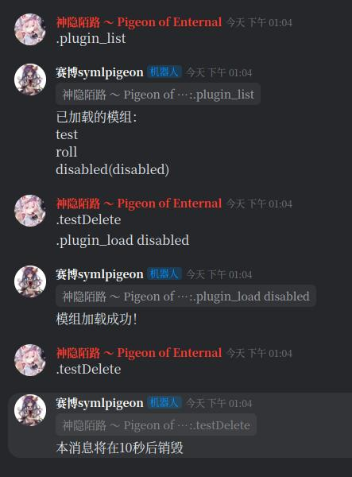
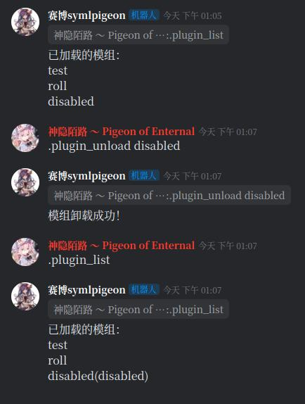

<!-- TOC -->
* [pythonKook](#pythonkook)
  * [使用方法](#使用方法)
    * [安装](#安装)
    * [使用](#使用)
      * [最简单的样例](#最简单的样例)
      * [插件系统](#插件系统)
  * [项目结构](#项目结构)
  * [事件处理机制](#事件处理机制)
  * [施工进度](#施工进度)
    * [API施工进度](#api施工进度)
    * [多媒体消息](#多媒体消息)
    * [更好的HTTP请求性能](#更好的http请求性能)
    * [上层的封装](#上层的封装)
    * [多个事件处理函数](#多个事件处理函数)
    * [文档？](#文档)
* [感谢和免责声明](#感谢和免责声明)
<!-- TOC -->

# pythonKook
自用Kook机器人轮子，希望能够为自己写Kook机器人的时候提供一些便利。（纯粹自己重复造轮子玩的状态x）

很明显，[khl.py](https://github.com/TWT233/khl.py)是一个更好的实现，请用他们的实现。

## 使用方法

### 安装

~~我暂时还没想好该怎么弄，先直接git clone下来然后import吧！~~

~~后面考虑用pip之类的方法来搞。~~

暂时采用了flit来进行打包，确实比写setup.py方便多了。

当项目达到一定阶段时，会发布release。

### 使用

#### 最简单的样例

```python
from pyKook.App.Bot import Bot
from pyKook.Config import accountConfig, botConfig

import asyncio

account_conf = accountConfig("Bot", "你的token", "zh-CN")
# 使用 . 来做命令前缀，比如说.r 1d6， .kick xxx等等
bot_conf = botConfig(command=".")
# 你的Bot对象
bot = Bot({"accountConfig": account_conf, "botConfig": bot_conf})

@bot.on_event("isMentioned.atMe") # 有人at我
async def onMentioned(event):
    await bot.sendText(event.getChannel(), "你好！")
    
@bot.on_command("roll")
async def onRoll(event):
    import random
    await bot.sendText(event.getChannel(), "你掷出了一个1d6的骰子，结果是：{}".format(random.randint(1, 6)))

async def main():
    await bot.initialize()
asyncio.run(main())
```

#### 插件系统

采用importlib修改导入模块来实现变量的注入，依次实现一个比较方便的插件系统。

为了便于管理和开发，机器人采用了插件系统进行功能扩展。
新建一个机器人项目，结构如下所示：

```
myBot
 - main.py
 - plugins/
   - roll.py
   - test.py
   - disabled.py
   - ...
```

其中`plugins`文件夹下存放了机器人实现的各类功能。以下面这个简单的例子来说明。
编写`main.py`。

```python
import asyncio

from pyKook.App.Bot import Bot
from pyKook.Config import accountConfig, botConfig

accountConf = accountConfig("Bot", "你的token", "zh-CN")
botConf = botConfig(
    command=".",
    superusers=["具有操作机器人重要权限的人kook id"],
    # 启用插件系统，如果False则插件系统不会启动
    # 且下面的选项也不会生效，
    # Bot只加载当前main.py中的命令
    plugin_enable=True, 
    # 插件所在文件夹的路径，带上“/”
    plugin_path="plugins/", 
    # 不需要加载的插件，如果你要禁用某个插件文件下面的所有命令
    # 请直接写这个插件的文件名，
    # 如果你要禁用某个插件下面的一个函数，则采用“插件名.函数名”的形式
    # 在这里，我们禁用了disabled.py和test.py中的eventIgnoreMe函数
    exclude_plugins=["disabled", "test.eventIgnoreMe"],
    # 插件管理器提供了三个基本的命令用于动态加载管理：
    # plugin_list: 列出所有的插件
    # plugin_load: 加载一个被禁用的插件
    # plugin_unload: 禁用一个已经加载的插件
    # 如果你不要这个命令或者想要自行实现，可以将这个选项设置为False
    use_plugin_cmd=True,
)
bot = Bot({"accountConfig": accountConf, "botConfig": botConf})


async def main():
    await bot.initialize()

asyncio.run(main())
```

`roll.py`内容如下所示

```python
@bot.on_command("r")
async def roll(msg):
    import random
    contents = msg.content().lstrip(".r ").strip().split("d")
    try:
        l, r = contents
        l = int(l)
        r = int(r)
        dices = []
        for _ in range(l):
            dices.append(random.randint(1, r))
        ans = "".join(["%d+" % i for i in dices])[:-1] + "= {}".format(sum(dices))
        await bot.sendText(msg.getChannel(), ans, reply=msg)
    except:
        await bot.sendText(msg.getChannel(), "参数错误！", reply=msg)
```

你可能会注意到，这里的`bot`变量提示**未解析的引用**，
不要担心这个问题，插件在加载时会自动向模块内注入`bot`变量。
如果你需要使用IDE提供的代码检查机制，你可以采取如下的方式：

```python
from pyKook.App.Bot import Bot
from pyKook.App.Object import Message

bot: Bot # 让这里提示bot变量的类型

@bot.on_event("isMentioned.atMe") # 这里会提示“可能未定义”，不用担心
async def eventIsMentioned(msg: Message):
    channel = msg.getChannel()
    sender = msg.getAuthorId()
    await bot.sendRichText(channel, "(met){}(met)你at你马呢？".format(sender))

@bot.on_command("ignore_me")
async def eventIgnoreMe(msg: Message):
    channel = msg.getChannel()
    sender = msg.getAuthorId()
    await bot.sendRichText(channel, "Nothing happened.".format(sender))
```

`disabled.py`内容如下所示

```python
from pyKook.Utils.timer import Timer

@bot.on_command("testDelete")
async def testDelete(msg):
    msg_id = await bot.sendText(msg.getChannel(), "本消息将在10秒后销毁", reply=msg)
    msg_sent = bot.getMessageById(msg_id)
    if not msg_sent:
        return
    timer = Timer(10, bot.deleteMessage, message=msg_sent)
    timer.start()
```

模组的动态加载、卸载如图所示：





## 项目结构

`pyKook`为项目的根目录。下方包括了`pyKook`的所有子模块。

- `App`模块为群组机器人的核心功能组件，包括具体的消息处理机制和回调函数设置。

- `Config`模块旨在提供封装的、便利的配置文件接口。

- `Api`模块封装了Kook文档中的有关API，便于调用。

- `Utils`为工具模块，提供了网络连接等关键功能。

## 事件处理机制

~~各种回调函数组成的地狱~~

当程序启动，`App`模块中的`Bot`对象读取相应配置后，通过`gateway`接口获取网关。
随后，一个全局的`Api.eventAPI.websocketMsgHandler`对象被实例化，
其对象池中的一个`websocketHandler`对象建立属于`bot`的ws连接。
随后，通过ws接收到的每一个数据包都会经由`websocketMsgHandler`处理，产生一个“事件”消息发送给`Bot`。

“事件”消息包括了两个部分，分别是事件标识和事件数据。
事件数据是对原始的websockets数据包进行了解析后的数据，其作为一个基本的类提供了部分比较方便的接口用于调用。
事件标识是一个字符串，其标识这个事件的类型，基本分为以下的部分：


|事件标识| 事件类型 |
|---|------|
|`onMentioned`| 被@   |
|`onSystemMessage`| 系统消息 |
|`onNormalMessage`|普通群聊消息更新|
|`onContextUpdate`|带有上下文聊天的消息|

其中`onSystemMessage`包含系统消息、群组消息等各类子事件。

`Bot`对象根据事件标识，调用相应的回调函数对事件进行处理，基本的处理方式包括回应等均为通过`Api`模块调用相应接口。

可以说，本项目基本是**一个*事件驱动*的框架**。


## 施工进度

目前该项目仍在施工的早期阶段。

**目前，我们开发的核心方向是实现基本的机器人功能，即最基础的信息获取、消息回应机制。**

|模块| 进度          |
|---|-------------|
|`App`| 锐意进行中       |
|`Config`| 下一步准备完善本地存储 |
|`Api`| 锐意进行中       |
|`Utils`| 随项目进行       |

### API施工进度

**目前计划实现部分**：

- [x] 事件获取
  - [x] Websocket方式
  - [ ] ~~Webhook方式（懒了，不想写）~~
  - [ ] ~~轮询？（暂时不考虑）~~

- [x] HTTP接口
  - [x] 服务器相关接口列表
    - [x] 获取当前用户加入的服务器列表
    - [x] 获取服务器详情
    - [x] 获取服务器中的用户列表
  - [x] 频道相关接口列表
    - [x] 获取频道列表
    - [x] 获取频道详情
  - [x] 频道消息相关接口
    - [x] 发送频道聊天消息
    - [x] 删除频道聊天消息
  - [x] Gateway相关接口
  - [x] 用户相关接口
    - [x] 获取当前用户信息
    - [x] 获取目标用户信息

- [ ] 事件接口
  - [ ] 频道相关事件
    - [ ] 频道消息更新
    - [x] Card按钮事件
  - [ ] 服务器成员相关事件
    - [ ] 新成员加入服务器
  - [x] 消息相关事件
    - [x] 文字消息
    - [x] KMarkdown消息
    - [x] Card消息

实际上还有好多API虽然不在表里，但是我脑子一热说不定就写了。

### 多媒体消息

图片、视频、音频等多媒体消息需要上传文件并处理。这部分尚未想到好的解决办法。

毕竟上传的话要是文件大一点我怕整个程序都被阻塞掉。

- [ ] 多媒体消息
  - [ ] 想到一个合理的解决方案
  - [ ] 完成解决方案

因为我目前自己的需求用不到这个功能，目前这个任务的优先级非常低。

### 更好的HTTP请求性能

啊啊啊啊啊啊，多页的multiPageAPI采用了并发的方式请求，但是单独的查询方法我还没想到更好的方法去优化。

听说aiohttp性能更好（同时兼容requests和ws），考虑后续迁移过去。

又或者说，我们考虑一下多线程/多进程的方案？实际上websockets和一般的http请求可以放在两个独立的线程中进行？

- [ ] 寻找更好的网络请求性能（选择）
  - [ ] 迁移到`aiohttp`
  - [ ] 多线程/多进程

### 上层的封装

子模块写的太难看了，App模块里面要封装一下。

`Bot`对象还是太乱了，考虑把这个`class`拆分一下。

- [ ] 对`Bot`模块进行拆分

### 多个事件处理函数

很明显，一个事件可能会有多个处理函数，但是目前的机制只能够支持一个处理函数。

也不难改，主要是改了之后伤筋动骨，不知道会不会引入什么新的bug？

- [ ] 多个事件处理函数

### 文档？

~~自己用的东西，写什么文档？~~

会写的，会写的（咕咕咕）

# 感谢和免责声明

感谢Kook的文档，感谢websockets、grequest等Python模块的开发者。

感谢博德之门3，真的太好玩了。~~我真的好想玩星空啊！~~

本项目仅仅是我一时兴起的产物，本人对项目的可靠性、稳定性、安全性等等都不做任何保证。如果你使用了本项目，那么你需要自行承担一切可能的后果。
任何对本项目的使用、修改、传播等都无所谓。